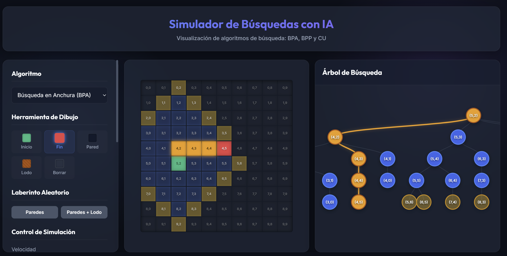
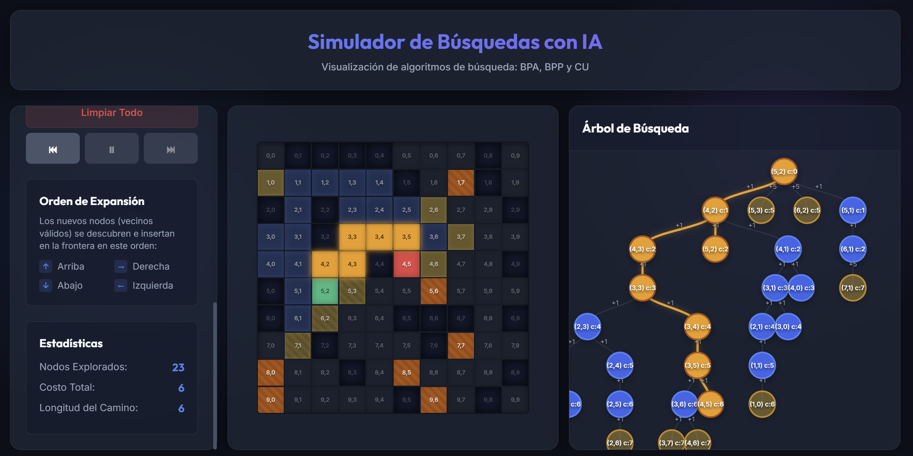

# Simulador de Búsquedas con IA 🤖🔍

Una herramienta educativa, interactiva y visual para enseñar y comprender cómo funcionan los algoritmos de búsqueda elementales en Inteligencia Artificial. Diseñada especialmente para estudiantes y profesores.



## 📌 Características Principales

Esta aplicación permite visualizar paso a paso el proceso de exploración, la formación de la frontera y la reconstrucción del camino óptimo utilizado por los algoritmos clásicos de IA:

*   **Búsqueda Primero en Anchura (BPA/BFS)**: Garantiza el camino más corto en grafos no ponderados. Explora el laberinto nivel por nivel de forma radial.
*   **Búsqueda Primero en Profundidad (BPP/DFS)**: Explora un camino hasta llegar a un callejón sin salida (Pared) antes de retroceder (*backtracking*).
*   **Costo Uniforme (CU/UCS)**: Encuentra la ruta más barata considerando los costos variables de moverse a través del terreno (ej. lodo vs celdas normales).

### 🛠 Herramientas Interactivas
*   **Dibujo Personalizado**: Pinta directamente sobre la cuadrícula la celda de inicio, la meta, y dibuja obstáculos (paredes) o terrenos difíciles (lodo) a discreción.
*   **Generación Aleatoria**: Crea laberintos instantáneos con un clic, con opciones para solo paredes o un entorno mixto (Paredes + Lodo).
*   **Controles de Simulación**: Pausa, avanza o retrocede paso a paso en el tiempo para analizar detalladamente la toma de decisiones del algoritmo.
*   **Árbol de Búsqueda Dinámico**: Mientras ocurre la exploración en el laberinto, se dibuja un árbol jerárquico que muestra cómo se conectan los nodos (estado padre a hijo) y revela los costos de transición en las aristas.



## 💻 Tecnologías Utilizadas

Este proyecto sigue una arquitectura mantenible y está construido íntegramente del lado del cliente, por lo que **no requiere un servidor backend**.

*   **HTML5 & CSS3**: Utilizando `CSS Grid`, `flexbox` y animaciones personalizadas para una experiencia "Glassmorphism" con Dark Mode activo.
*   **JavaScript (ES6+)**: Implementación rigurosa de estructuras de datos (*Colas, Pilas, Colas de Prioridad*) usando Vanilla JS.
*   **D3.js**: Biblioteca de visualización de datos empleada para renderizar matemáticamente el árbol de búsqueda en tiempo real.

## 🚀 Cómo Ejecutar o Alojar Este Proyecto

### De forma Local
Dado que son archivos estáticos, puedes revisar este proyecto con herramientas básicas:

1.  Clona o descarga este repositorio.
2.  Puedes usar una extensión como **Live Server** en VSCode.
3.  O bien, ejecutar un servidor de Python rápido en la terminal:
    ```bash
    python -m http.server 8080
    ```
4.  Visita `http://localhost:8080` en tu navegador.

## 👨‍🏫 Uso en el Aula de Clase
Recomendado para clases de Introducción a la Inteligencia Artificial. Los estudiantes están invitados a inspeccionar `/src/algorithms/` para estudiar el código fuente de BPA, BPP y CU, e incluso utilizar las funciones pre-construidas (`GridManager`) para aventurarse a implementar sus propios algoritmos heurísticos como **A*** o **Greedy Best-First Search**.
